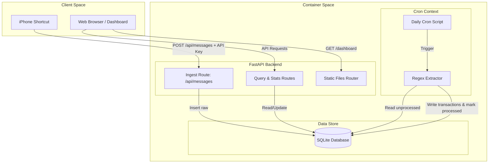

# Nami — System Design Document (v1)

This document describes the high-level architecture and system design of the **Nami Personal Finance Assistant (v1)**. Nami is a single-user personal finance tracker that ingests raw transaction messages (primarily SMS) and provides analytics via a React-based web dashboard.

---

## 1. High-Level Architecture

Nami is structured as a light, containerized web application consisting of three main tiers:
1. **Frontend (Presentation):** A React SPA built with TypeScript and styled with Tailwind CSS, utilizing a premium nautical theme.
2. **Backend (Application Layer):** A FastAPI server that exposes ingest and query APIs, and a standalone processing CLI (`generate_transactions.py`) invoked by system `cron`.
3. **Database (Data Store):** A local SQLite database managed via SQLAlchemy.



---

## 2. Ingestion Pipeline

The ingestion pipeline captures raw SMS texts from an iPhone Shortcut or third-party webhooks.

1. **Client Request:** The client makes a POST request to `/api/messages` with a payload of `{"message": "SMS text content..."}`.
2. **Authentication:** The custom middleware verifies that the header `X-API-Key` matches the environment variable `API_KEY`.
3. **Validation:** Pydantic schema ensures the message is a non-empty string.
4. **Storage:** The record is inserted into the SQLite `raw_messages` table with `processed = false`, `parse_failed = false`, and `received_at` set to the current UTC timestamp.

---

## 3. Transaction Processing (Batch Cron)

To avoid synchronous processing delays during SMS ingestion, the translation of SMS text into structured data is done via a daily cron job.

1. **Trigger:** A cron job schedules `generate_transactions.py` (e.g., at 11:00 PM daily).
2. **Fetch:** Query `raw_messages` table for all records where `processed = false`.
3. **Parsing:** For each raw message, the `TransactionGenerator` regex parser attempts to extract an INR currency amount.
4. **Result Action:**
   - **Successful Extraction:** Creates a new row in the `transactions` table containing the extracted amount, raw message foreign key, and copied timestamp.
   - **Failed Extraction:** Skips transaction creation and marks the raw message's `parse_failed` flag as `true`.
5. **State Finalization:** Marks the raw message's `processed` flag as `true`.

---

## 4. API Endpoints

### 4.1 Ingestion API
- **Endpoint:** `POST /api/messages`
- **Headers:** `X-API-Key: <secret_key>`
- **Request Body:**
  ```json
  {
    "message": "Your debit SMS text here"
  }
  ```
- **Response (201 Created):**
  ```json
  {
    "id": 1,
    "message": "Your debit SMS text here",
    "received_at": "2026-05-24T00:00:00Z",
    "processed": false,
    "parse_failed": false
  }
  ```

### 4.2 Query Transactions
- **Endpoint:** `GET /api/transactions`
- **Query Params:**
  - `date`: Filter by single date (`YYYY-MM-DD`)
  - `from`, `to`: Filter by custom date ranges (`YYYY-MM-DD`)
- **Response (200 OK):**
  ```json
  [
    {
      "id": 10,
      "raw_message_id": 1,
      "amount": 1200.0,
      "category": null,
      "description": "Your debit SMS text here",
      "timestamp": "2026-05-24T00:00:00Z",
      "created_at": "2026-05-24T00:01:00Z"
    }
  ]
  ```

### 4.3 Update Transaction
- **Endpoint:** `PATCH /api/transactions/{id}`
- **Request Body:**
  ```json
  {
    "category": "Food",
    "description": "Starbucks Coffee"
  }
  ```
- **Response (200 OK):**
  ```json
  {
    "id": 10,
    "raw_message_id": 1,
    "amount": 1200.0,
    "category": "Food",
    "description": "Starbucks Coffee",
    "timestamp": "2026-05-24T00:00:00Z",
    "created_at": "2026-05-24T00:01:00Z"
  }
  ```

### 4.4 Get Statistics
- **Endpoint:** `GET /api/stats`
- **Query Params:**
  - `from`, `to`: Filter range (`YYYY-MM-DD`)
- **Response (200 OK):**
  ```json
  {
    "total_spend": 1200.0,
    "category_breakdown": {
      "Food": 1200.0,
      "Transport": 0.0
    },
    "seven_day_trend": [
      {"date": "2026-05-18", "amount": 0.0},
      {"date": "2026-05-24", "amount": 1200.0}
    ],
    "todays_haul": 1200.0,
    "flagged_count": 0
  }
  ```

---

## 5. Security & Deployment

- **API Security:** Simple static API-key header validation `X-API-Key` configured in `.env`.
- **Database Safety:** SQLite engine will run with `check_same_thread=False` and uses a SQLAlchemy session scope lifecycle to prevent connection pool leaks.
- **Containerization:** The backend is packaged into a Docker container, with a mapped volume directory for the `finance.db` database to ensure data persistence across container builds and restarts.
